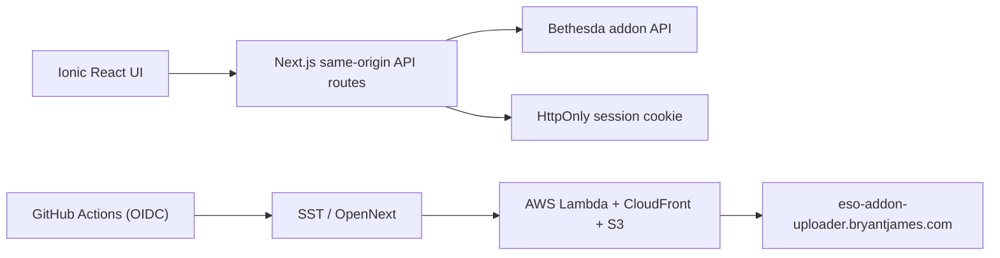

# Wayrest Workshop

An open-source, cross-platform browser for Elder Scrolls Online addons, with
Bethesda login, addon management, and an experimental publishing workflow.

**Live site:** [eso-addon-uploader.bryantjames.com](https://eso-addon-uploader.bryantjames.com)

**Developer docs:** [docs.eso-addon-uploader.bryantjames.com](https://docs.eso-addon-uploader.bryantjames.com)

> This is an independent community project. It is not affiliated with,
> endorsed by, or supported by Bethesda Softworks, ZeniMax Online Studios, or
> The Elder Scrolls Online.

## Why this exists

Addon publishing should not require trusting an opaque Windows-only executable.
Wayrest Workshop makes the client and its protocol adapter inspectable. Mac,
Linux, Windows, and mobile users can browse and download addons in a web
browser, while maintainers can audit exactly what happens to credentials,
archives, and metadata.

Open source does not magically create trust. It makes trust *verifiable*. This
project therefore keeps the sensitive surface small, documents what has been
observed versus inferred, and avoids claiming guarantees the upstream API does
not provide.

## Trust model

- Your Bethesda password is submitted only to a same-origin server route over
  HTTPS. The application does not save it.
- The resulting session token is stored in an `HttpOnly`, `Secure`,
  `SameSite=Lax` cookie, so browser JavaScript cannot read it.
- The Bethesda application key stays server-side in AWS and GitHub Actions. It
  is not compiled into the browser bundle.
- Public browsing and downloads do not require login.
- There is no advertising SDK. The production deployment uses the narrowly
  scoped Google Analytics events described below; credentials and archive
  contents are excluded.
- Source, infrastructure configuration, and deployment workflow are public.
- Publishing remains an explicit user action. An upload is never initiated in
  the background.

You still trust the operator of the deployment you use, its cloud account,
GitHub Actions, AWS, and Bethesda's API. For maximum control, review the code
and deploy your own copy. Use a unique password and never paste credentials
into an issue, log, or network capture.

See [SECURITY.md](SECURITY.md) for reporting and credential-handling guidance.

## Current capabilities

| Capability | Status |
| --- | --- |
| Browse and search the public addon catalog | Working |
| View addon details | Working |
| Reconstruct and download addon ZIP archives | Working |
| Bethesda authentication | Working |
| View addons owned by the signed-in account | Working |
| Create an addon draft | Working, based on observed API behavior |
| Edit owned addon metadata | Working, based on observed API behavior |
| Upload archive contents | Experimental; upstream handshake is inferred |

The upload flow is deliberately labeled experimental. Bethesda offered API
access but did not publish a schema, so the adapter is based on observed
requests and conservative inference. Upstream changes may break it. Please
avoid using irreplaceable archives without retaining a local copy.

## Architecture



The browser never calls Bethesda directly. Next.js route handlers normalize
the upstream responses, keep the application key private, and isolate protocol
changes from the UI. The deployment uses SST's OpenNext adapter on AWS.

Server routes validate identifiers and bounded input, enforce same-origin
checks on authenticated mutations, apply upstream timeouts, and reject
untrusted download URLs and unsafe archive paths. Reconstructed ZIP downloads
also enforce per-file, manifest, file-count, and total-size limits.

## Local development

Requirements:

- Node.js 22+
- npm
- A Bethesda-provided application key for authenticated operations

```bash
git clone https://github.com/the-jolly-green-bryant/eso-addon-uploader.git
cd eso-addon-uploader
cp .env.example .env.local
# Add BETHESDA_APP_KEY to .env.local
npm ci
npm run dev
```

Open <http://localhost:3000>. Environment files are gitignored. Never commit an
application key, password, session cookie, presigned URL, or traffic capture
containing authorization headers.

Run the full local gate with:

```bash
npm test
```

## AWS deployment

Production is described in [`sst.config.ts`](sst.config.ts) and deployed by
[`.github/workflows/deploy.yml`](.github/workflows/deploy.yml). Every pull
request runs unit tests, lint, strict type checking, and a production build. A
successful push to `main` deploys the production stage.

Prerequisites:

1. An AWS account for the application runtime and a Cloudflare-managed
   `bryantjames.com` DNS zone.
2. A GitHub OIDC IAM role trusted only by this repository and main branch.
3. A GitHub `production` environment with:
   - `AWS_ROLE_ARN` — the deploy role ARN.
   - `BETHESDA_APP_KEY` — the server-only Bethesda application key.
   - `CLOUDFLARE_API_TOKEN` — a narrowly scoped token with Zone DNS Edit.
   - `CLOUDFLARE_DEFAULT_ACCOUNT_ID` — the Cloudflare account ID.
4. Optional GitHub environment protection rules for production approval.

No long-lived AWS access key is stored in GitHub. Actions exchanges its signed
OIDC identity for short-lived AWS credentials. SST provisions the application,
CloudFront distribution, and TLS certificate on AWS, then maintains the
`eso-addon-uploader.bryantjames.com` DNS record through Cloudflare.

To deploy from an authenticated workstation:

```bash
BETHESDA_APP_KEY=... npm run deploy
```

## Protocol research

Treat captured traffic as sensitive source material:

- Capture only traffic from an account and machine you control.
- Redact authorization headers, cookies, passwords, app keys, presigned URLs,
  device identifiers, and unpublished addon content.
- Commit distilled schemas, fixtures with synthetic values, and explanations;
  never commit raw captures.
- Mark endpoints as **confirmed**, **observed**, or **inferred**.
- Keep upstream calls minimal and do not bypass authorization or rate limits.

The adapter lives under [`app/api/bethesda`](app/api/bethesda). Contributions
that improve validation, fixtures, error handling, or endpoint documentation
are especially welcome.

## Analytics and privacy

Production uses Google Analytics 4 to measure page views and a small set of
product events: catalog searches, addon detail clicks, mirror visits, ZIP
downloads, successful Bethesda logins, and addon draft creation or updates.
Bethesda usernames, passwords, session tokens, and archive contents are never
sent as analytics parameters. Search terms are measured because they directly
inform catalog usability; do not enter personal information into search.

## Contributing

Open an issue before undertaking a large protocol or UI change. Keep captured
data out of pull requests, include a test or reproducible validation where
possible, and explain whether endpoint behavior was observed or inferred.

This project follows the principle that users should be able to understand
what is sent, where it is sent, and why. Changes that obscure those answers
will not be accepted.

## License

[MIT](LICENSE)
